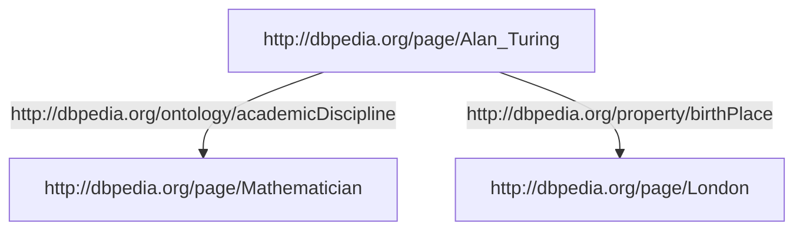

## RDF Turtle
Nowadays Terse [[RDF]] Triple Language (TURTLE) is used to express [[RDF]] in a machine readable way – TURTLE is also a W3C Recommendation

Schema:


RDF Turtle:
```xml-doc
@prefix dbo:<http://dbpedia.org/ontology/> .
@base <http://dbpedia.org/resource/> .

<Alan_Turing> dbo:academicDiscipline <Mathematician>;
              dbo:birthPlace         <London> .
```

All entities in <> specified by the [[URI]] http://dbpedia.org/resource/
