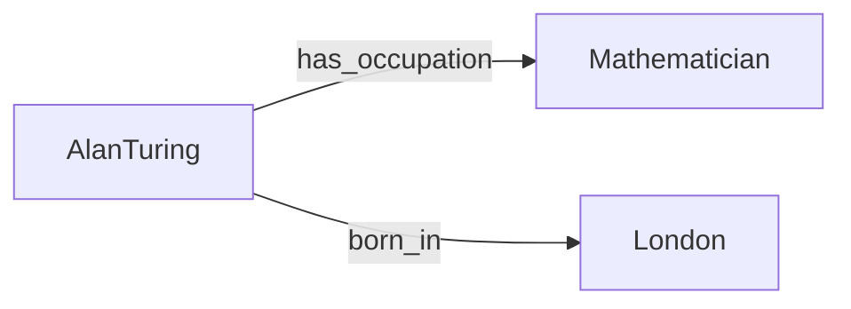

## Resource Description Framework (RDF)
Basic idea: decompose knowledge into small pieces, called triples {subject, predicate, object}

"Alan Turing was a well-known mathematician born in London"

RDF utilizes [[URI]] (URIs) to unambiguously identify the triple components

### See also
[[RDF Turtle]]