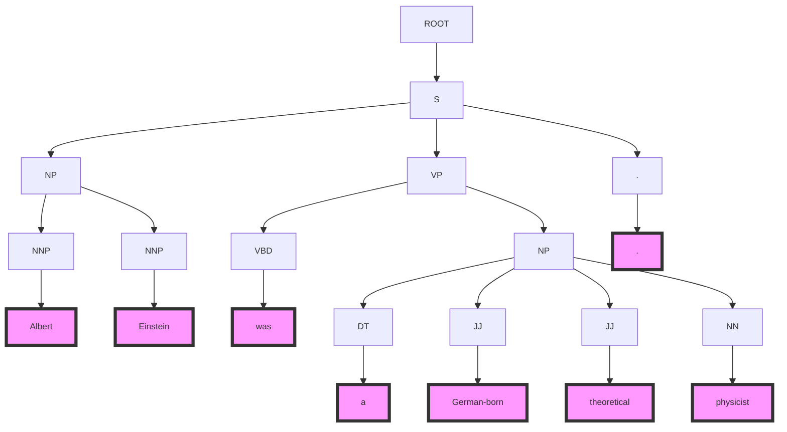

## Syntactical Parsing
- Part-of-Speech (XPOS):
![[SP_Part-of-speach-XPOS.png]]
- Lemmas:
![[SP_Lemmas.png]]
- Universal Dependancies
![[SP_Universal-dependencies.png]]

Constituency parse:

```mermaid
flowchart TD
ROOT-->S
S-->NP1[NP]
S-->VP[VP]
S-->.1[.]
NP1-->NNP1[NNP]
NP1-->NNP2[NNP]
VP-->VBD[VBD]
VP-->NP2[NP]
.1-->.2[.]
NNP1-->Albert
NNP2-->Einstein
VBD-->was
NP2-->DT
NP2-->JJ1[JJ]
NP2-->JJ2[JJ]
NP2-->NN
DT-->a
JJ1-->German-born
JJ2-->theoretical
NN-->physicist


classDef EndVertices fill:#f9f,stroke:#333,stroke-width:4px;
class Albert,Einstein,was,a,German-born,theoretical,physicist,.2 EndVertices;
classDef FixFont font-size:11px;
class ROOT,S,NP1,VP,.1,NNP1,NNP2,VBD,NP2,DT,JJ1,JJ2,NN,Albert,Einstein,was,a,German-born,theoretical,physicist,.2 FixFont;
```

