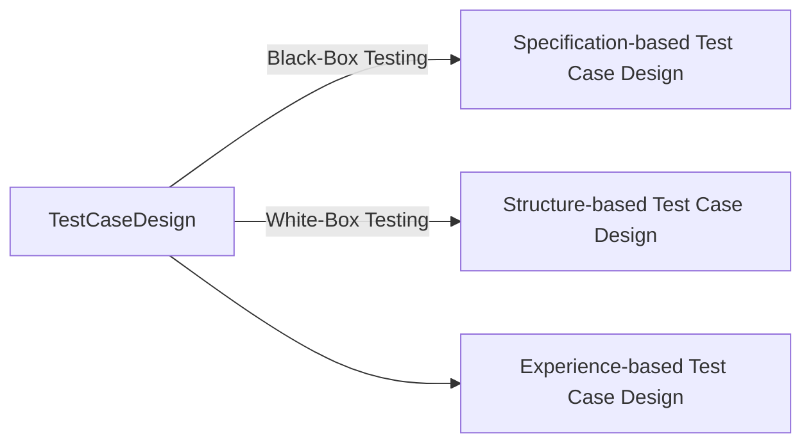

## Dynamic Testing
*Programs are static descriptions of dynamic processes.**

[[Static Testing|Static tests]] evaluate the test object, e.g. informal descriptions, models, source code, per se. Dynamic tests evaluate the executable system during execution. Variables are changed and the respective output values are monitored.
![[Dynamic_testing.png]]

**[[Black-Box Testing]] vs. [[White-Box Testing]]**
- Black-Box Testing: Input values Derived without knowledge of the internal logic
- White-Box Testing: Input values Derived with knowledge of the internal logic