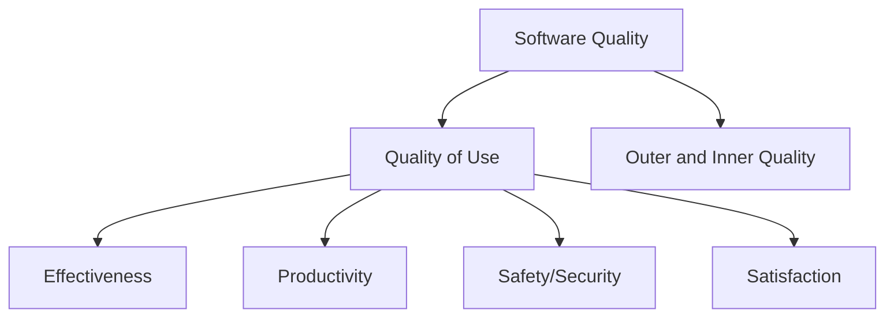

## Quality
Quality: All characteristics and features of a product or activity relating to its suitability to meet given needs
- Quality refers to Product and Process.
- Quality requirements change with time!
- Quality must be weighed against costs and time!

### See also
[[Quality of Use]]
[[Outer and Inner Quality]]