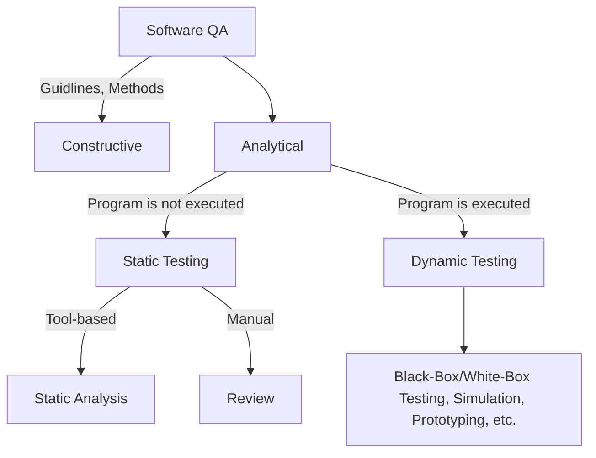

## Static Testing
**Static Testing** verifies documents and specification.
- Informal documents are verified by reviews.
- Formal documents are verified by static analysis.
![[Static_testing.png]]

